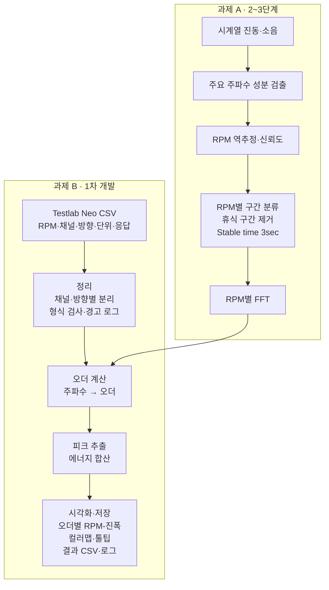

# 진동·소음 시험 데이터 자동 분석(RPM 구간 분류·오더 분석) — 프로젝트 기획서

| 항목 | 내용 |
|---|---|
| 리포 | data09-06 |
| 제출자 | 조윤제 |
| 직무·소속 | 제출 자료에 명시되지 않음 (진동·소음(NVH) 시험·분석 업무 담당으로 보임 — (가정)) |
| 과정 | 현장 데이터 디지털화 전문가과정 1차수 |
| 작성일 | 2026-09-28 |
| 문서 상태 | 초안 v0.1 — 수강생 제출 자료 기반 |

제출자는 두 개의 게시물을 올렸습니다. 둘 다 진동·소음 시험 데이터 분석이지만 **입력 데이터가 다릅니다**(게시물 1은 RPM 정보 없는 시계열, 게시물 2는 Testlab Neo에서 내보낸 RPM별 주파수축 CSV). 그래서 이 문서에서는 과제 A와 과제 B로 나누어 다룹니다.

- **과제 A** — 진동·소음 시계열 데이터 기반 RPM Step 자동 구간 분류 및 NVH 분석 (게시물 1, 2026-09-09)
- **과제 B** — 소음진동 오더 분석 도구 (게시물 2, 2026-09-23)

**1차 개발 대상: 과제 B.** 이유는 세 가지입니다. ① 입력 형식(Testlab Neo export CSV)이 정해져 있고, 제출자가 초안 HTML과 예시 입력 CSV를 이미 만들어 메일로 보냈다고 적었습니다. ② 주파수축 데이터에 RPM이 이미 들어 있어 RPM 역추정 없이 오더 계산이 가능합니다. ③ 과제 B의 오더 계산·시각화 부분은 과제 A 파이프라인의 마지막 단계(FFT/Order 분석)와 겹치므로, B를 먼저 만들면 A에서 그대로 재사용할 수 있습니다.

## 1. 추진 배경과 현안

### 과제 A — 시계열 RPM Step 자동 구간 분류
- 진동·소음 시험 시 RPM 센서 데이터 없이 시계열 데이터만 확보되는 경우가 많습니다.
- 시험은 100 → 휴식 → 200 → 휴식 → 300 RPM과 같이 Step 방식으로 수행됩니다.
- 현재 절차: 전체 시계열 → 사람이 RPM 구간 확인 → 구간별 데이터 추출 → FFT → 주요 성분 확인 → Order 분석
- 문제점: RPM 구간과 휴식 구간을 수작업으로 확인·제거하고, RPM별 데이터를 개별 추출하는 동일 작업이 반복됩니다. 그 결과 분석 시간이 늘고 작업자별 결과 편차가 생깁니다.

### 과제 B — 오더 분석 도구
- 배경: 시험 스펙트럼 데이터를 신속하게 오더 성분으로 분석하고 시각화하려는 것입니다.
- 현안(가정): 현재는 Testlab Neo에서 내보낸 결과를 엑셀 등에서 따로 가공해 오더별 그래프를 그리고 있을 것으로 보입니다. 실제 현재 방식은 10절에서 확인합니다.

## 2. 목표

**최종 목표**
진동·소음 시험 데이터를 넣으면 RPM 구간 분류, FFT, 오더 분석, Campbell Diagram, 주요 성분 Summary까지 사람 손을 거치지 않고 같은 기준으로 나오는 분석 도구를 만듭니다(과제 A+B 통합).

**1차 개발 목표 (과제 B)**
- Testlab Neo export CSV(RPM, 채널, 방향, 단위, 진동소음 응답)를 브라우저에 올리면
- 오더 분석, 피크 추출, 진동소음 에너지 합산을 계산하고
- 오더별 RPM-진폭 그래프, 스펙트럼 컬러맵, 피크 정보 툴팁으로 보여 주며
- 결과 CSV와 오류·경고 로그를 저장합니다.
- 제출자의 초안 HTML을 출발점으로 삼아 기능을 정리·보강합니다.

## 3. 보유 데이터

| 데이터 | 형태 | 규모·주기 | 비고(민감도 등) |
|---|---|---|---|
| [B] Testlab Neo export 주파수축 CSV — RPM, 채널, 방향, 단위, 진동소음 응답 | CSV | 시험 건별 / 파일 크기·행 수 미확인 | 예시 파일을 메일로 받았다고 기재 — 이번 작성 자료에는 포함되지 않음 |
| [B] 제출자 초안 HTML 도구 | HTML | 1건 | 메일 전달 — 이번 작성 자료에는 포함되지 않음 |
| [A] 진동·소음 시계열 시험 데이터(메타데이터 포함) | 미확인(CSV 또는 측정장비 원본 형식 추정 — (가정)) | 시험 건별 | RPM 센서 데이터 없음 |
| [A] RPM step 정보 | 설정값 | 시험 건별 | start rpm, end rpm, rpm step, rpm tolerance |
| [A] 주파수 분석 정보 | 설정값 | 시험 건별 | sampling rate, fft range, fft line, window, overlap |
| [A] Stable time 정보 | 설정값 | 3sec | 원문 기재값 |
| [A] 오더 분석 정보 | 설정값 | 시험 건별 | order range, major order detection |

제품 사양이 드러나는 시험 결과이므로 외부 AI 서비스로 보내지 않는 구조를 전제로 합니다.

## 4. 해결 방안 개요

- 오더는 일반적으로 `오더 = 주파수(Hz) × 60 / RPM` 으로 계산합니다. 이 도구에서 쓰는 정의(기준 축, 기어비 적용 여부 등)는 제출자와 맞춥니다(10절).
- 과제 A의 흐름은 제출 원문의 순서(주요 주파수 성분 자동 검출 → 회전 성분/Order 분석 → RPM 역추정 → RPM별 시험구간 자동 분류 → 휴식구간 자동 제거 → RPM별 데이터 자동 추출 → FFT/Order 분석 자동화)를 그대로 따릅니다.
- 과제 A의 RPM 역추정은 "어느 오더의 성분이 기준이 되는지"(예: 1차 회전 성분)를 알아야 성립합니다(가정). 이 기준을 시험 조건별로 받아야 합니다.

## 5. 주요 기능

### 과제 B — 오더 분석 도구 (1차 개발)

| 기능 | 설명 | 우선순위 |
|---|---|---|
| CSV 불러오기·형식 검사 | Testlab Neo export CSV 업로드, RPM·채널·방향·단위·응답 컬럼 인식, 빈 값·형식 오류를 경고 로그로 기록 | MVP |
| 채널·방향 선택 | 채널·방향별로 결과를 나누어 보기 | MVP |
| 오더 변환 | 주파수축을 RPM별 오더축으로 변환 | MVP |
| 오더 추적 | 지정한 오더(order range)의 RPM별 진폭 추출 → 오더별 RPM-진폭 그래프 | MVP |
| 피크 추출 | RPM별·오더별 최대 피크(주파수, 오더, 진폭) 목록 | MVP |
| 에너지 합산 | 지정 대역(또는 오더 대역)의 진동소음 에너지 합산 (합산 방식은 제출자 기준 확인 — (가정): 제곱합의 제곱근) | MVP |
| 스펙트럼 컬러맵 | RPM × 주파수(또는 오더) 컬러맵 | MVP |
| 피크 정보 툴팁 | 그래프 위에 마우스를 올리면 RPM·주파수·오더·진폭 표시 | MVP |
| 결과 CSV 저장 | 오더별 결과·피크 목록·에너지 합산 CSV | MVP |
| 오류·경고 로그 저장 | 처리 중 발생한 경고를 텍스트/CSV로 저장 | MVP |
| 단위 변환·dB 표시 | 선형·dB 전환 | 확장 |
| 여러 시험 비교 | 두 개 이상의 CSV를 겹쳐 비교 | 확장 |

### 과제 A — 시계열 RPM Step 자동 분류 (2~3단계)

| 기능 | 설명 | 우선순위 |
|---|---|---|
| 시계열 불러오기 | 시계열·메타데이터 읽기, sampling rate 확인 | 확장 |
| 구간별 짧은 FFT | window·overlap 설정으로 시간에 따른 주파수 변화 계산 | 확장 |
| 주요 주파수 자동 검출 | 시간 구간별 지배 주파수 추적 | 확장 |
| RPM 역추정·신뢰도 | 기준 오더로 RPM 환산, 신뢰도 산출 | 확장 |
| RPM Step 자동 분류 | start/end rpm, rpm step, rpm tolerance 기준으로 구간 배정 | 확장 |
| 휴식 구간 제거·Stable time 적용 | 3sec 안정 구간만 채택 | 확장 |
| RPM별 데이터 추출 | 구간별 시계열 파일 출력 | 확장 |
| RPM별 FFT·오더 결과 | 과제 B 엔진 재사용 | 확장 |
| Campbell Diagram | RPM × 주파수 × 진폭 | 확장 |
| 주요 성분 Summary | RPM별 주요 오더·피크 요약표 | 확장 |

## 6. 기대 산출물

- [B] 브라우저 오더 분석 도구(HTML 파일 하나, 제출자 초안 기반 개선판)
- [B] 결과 CSV(오더별 RPM-진폭, 피크 목록, 에너지 합산), 오류·경고 로그
- [B] 오더별 RPM-진폭 그래프, 스펙트럼 컬러맵 화면
- [A] RPM별 진동소음 시계열 데이터, 실제 추정 RPM 및 신뢰도, RPM별 FFT 결과, RPM별 주요 Order 결과, Campbell Diagram, 주요 진동·소음 성분 Summary (원문 Output 그대로)
- 사용 안내문, 계산식 설명서(오더 정의·에너지 합산 방식)

## 7. 기술 구성

| 과정 도구 | 이 과제에서의 쓰임 |
|---|---|
| 코랩(Python) | numpy·scipy로 FFT·오더 계산 검증, 과제 A의 RPM 역추정 알고리즘 시험 (DAY2) |
| 바이브코딩 | 제출자가 이미 초안 HTML을 만든 방식 — 이를 이어서 개선 |
| 생성형 AI | 주요 성분 Summary 문장화(확장, 선택) |
| Dify / Make | 이 과제의 핵심 경로에는 필요하지 않음 |

**개발 빌드**
- 과제 B: 설치가 필요 없는 브라우저 정적 웹 도구. CSV 파싱·계산·그래프(Plotly.js 등)를 모두 브라우저 안에서 처리해 시험 데이터가 밖으로 나가지 않게 합니다.
- 과제 A: 시계열은 sampling rate에 따라 파일이 커질 수 있어(가정) 1차 검증은 코랩(Python)으로 하고, 파일 크기가 허용되면 브라우저 도구에 같은 로직을 옮깁니다. 너무 크면 사내 PC에서 돌리는 Python 스크립트로 제공합니다.

## 8. 개발 단계

**1단계 — 지금 바로 개발 가능한 부분 (과제 B)**
- 원문에 입력 컬럼(RPM, 채널, 방향, 단위, 응답)과 출력 3종이 명확하므로 다음을 바로 만들 수 있습니다.
  - CSV 업로드·형식 검사·경고 로그
  - 주파수 → 오더 변환, 오더별 RPM-진폭 그래프, 스펙트럼 컬러맵, 툴팁
  - 피크 추출, 에너지 합산, 결과 CSV 저장
- 단, **제출자가 메일로 보낸 초안 HTML과 예시 CSV를 먼저 받아야** 실제 컬럼 배치(가로형/세로형)에 맞출 수 있습니다. 받기 전에는 컬럼 배치를 고를 수 있게 만들고 가상 샘플로 검증합니다(가정).

**2단계 (과제 A 기초)**
- 시계열 샘플을 받아 코랩에서 구간별 FFT·주요 주파수 검출을 검증
- 입력 설정값(start/end rpm, rpm step, rpm tolerance, sampling rate, fft range, fft line, window, overlap, Stable time 3sec, order range)을 받는 화면 구성
- RPM 역추정과 신뢰도, RPM Step 자동 분류·휴식 구간 제거

**3단계 (통합)**
- 과제 A의 RPM별 구간 추출 결과를 과제 B 오더 엔진으로 연결
- Campbell Diagram, 주요 진동·소음 성분 Summary 출력
- 작업자 수작업 결과와 자동 결과를 같은 시험으로 비교해 편차 확인

## 9. 기대 효과

- 오더 분석·시각화를 파일 하나 올리는 것으로 끝내 시험 결과 검토가 빨라집니다(과제 B).
- RPM 구간 확인·휴식 구간 제거·구간별 추출이라는 반복 수작업을 줄입니다(과제 A).
- 같은 설정값으로 같은 결과가 나오므로, 원문에서 지적한 작업자별 결과 편차가 줄어듭니다.
- RPM 센서 없이 확보된 시험 데이터도 RPM별로 분석할 수 있게 됩니다(과제 A).

(원문에 수치 목표가 없어 정량 효과는 적지 않았습니다.)

## 10. 확인 필요 사항

1. **메일로 보냈다는 초안 HTML 파일과 예시 Input CSV** — 이번 작성 자료에는 포함되지 않았습니다. 받아야 1단계를 실제 형식에 맞출 수 있습니다.
2. 직무·소속, 주로 다루는 장비(시험 대상 기종·부위)
3. Testlab Neo CSV의 배치: RPM이 행이고 주파수가 열인 형태인지, 한 행에 (RPM, 주파수, 값)이 있는 형태인지, 채널·방향이 파일 안에 함께 있는지
4. 응답 단위(가속도 g·m/s², 음압 Pa·dB 등)와 dB 기준값
5. 오더 정의: 기준 회전축(엔진, 모터, 펌프 등)과 기어비 적용 여부
6. 에너지 합산 방식(제곱합의 제곱근 여부, 합산 대역 기준)
7. 피크 추출 기준(임계값, 오더당 몇 개)
8. [A] 시계열 원본 형식(파일 형식, 채널 수, sampling rate, 한 시험의 길이)
9. [A] RPM 역추정의 기준 성분 — 어느 오더를 기준으로 RPM을 환산하는지
10. [A] 휴식 구간 판정 기준(진폭 크기 등)과 Stable time 3sec의 적용 위치(구간 시작 후 3sec 제외인지, 3sec 이상 유지된 구간만 채택인지)
11. 현재 분석 1건당 소요시간(효과 측정용)

## 부록. 제출 원문 요약

- 게시물 1 (2026-09-09) 「진동·소음 시계열 데이터 자동 분석」: 추진 배경, 현 문제점, RPM Step 자동 구간 분류 및 NVH 분석 흐름, Input(시계열·RPM step·주파수 분석·Stable time 3sec·오더 분석 정보) / Output(RPM별 시계열, 추정 RPM·신뢰도, RPM별 FFT·Order, Campbell Diagram, Summary)
- 게시물 2 (2026-09-23) 「소음진동 오더 분석 도구 개발」: Input(Testlab Neo export 주파수축 CSV), Output 1~3(오더 분석·피크·에너지 합산 / 시각화 / CSV·로그 저장), 초안 HTML·예시 CSV는 메일 전달로 기재
- 첨부 파일: 패들릿 첨부 없음. 메일로 전달했다는 초안 HTML·예시 CSV는 이번 작성 자료에 포함되지 않음
