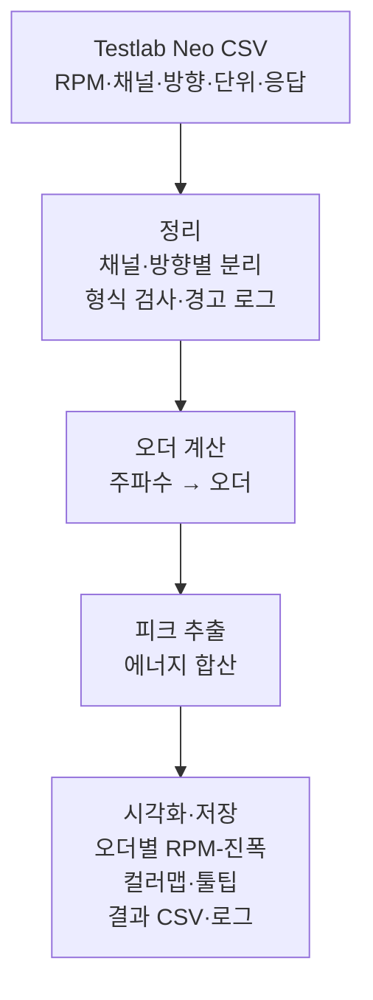

# 소음진동 오더 분석 도구 — 프로젝트 기획서

| 항목 | 내용 |
|---|---|
| 리포 | data09-06 |
| 제출자 | 조윤제 |
| 직무·소속 | 제출 자료에 명시되지 않음 (진동·소음(NVH) 시험·분석 업무 담당으로 보임 — (가정)) |
| 과정 | 현장 데이터 디지털화 전문가과정 1차수 |
| 작성일 | 2026-09-28 (v0.5 · v0.6 갱신 2026-09-30, v0.7 갱신 2026-10-02) |
| 문서 상태 | 초안 v0.7 — 2026-10-02 요청 7가지 반영(12장: 첫 화면 그림 높이 · 엔진식 지게차 추가 · 업로드 칸 절반 · Contribution Analysis 상시 표시 · 세 영역 접기 · 단위 설정 기본 펼침 · 「분석 실행」 버튼) / v0.6 — data09-29(제출자 분석기 v51 + 지게차 첫 화면)를 제출자 답변대로 이 리포에 통합: 첫 화면 = v51 + 전동 지게차 그림 · 가상 캠벨 선도, 이전 도구는 classic/ 로 보존, 두 번째 CSV 채널 오류 수정 (v0.5 = v40 기준 Overall·오더 기여도) |

이 문서는 제출자의 게시물 「소음진동 오더 분석 도구 개발」(2026-09-23)과 2026-09-28 댓글로 받은 **제출자 분석기 v34(HTML)와 Testlab Neo 실제 내보내기 CSV 2종**을 바탕으로 합니다. 주파수축 데이터마다 RPM 이 붙어 있어 별도의 RPM 추정 없이 오더 계산이 가능하며, 계산 기준은 v34 를 따릅니다.

## 1. 추진 배경과 현안

- 배경: 시험 스펙트럼 데이터를 신속하게 오더 성분으로 분석하고 시각화하려는 것입니다.
- 현안(가정): 현재는 Testlab Neo에서 내보낸 결과를 엑셀 등에서 따로 가공해 오더별 그래프를 그리고 있을 것으로 보입니다. 실제 현재 방식은 10절에서 확인합니다.

## 2. 목표

**최종 목표**
Testlab Neo에서 내보낸 진동·소음 시험 결과를 넣으면 오더 분석, 피크 추출, 에너지 합산, 시각화, 결과 저장까지 같은 기준으로 나오는 분석 도구를 만듭니다.

**1차 개발 목표**
- Testlab Neo export CSV(RPM, 채널, 방향, 단위, 진동소음 응답)를 브라우저에 올리면
- 오더 분석, 피크 추출, 진동소음 에너지 합산을 계산하고
- 오더별 RPM-진폭 그래프, 스펙트럼 컬러맵, 피크 정보 툴팁으로 보여 주며
- 결과 CSV와 오류·경고 로그를 저장합니다.
- 제출자 분석기 v34 의 계산(피크 검색 → 합산 RSS, 오더 RSS 합산, dB/dBA 표시)을 기준으로 삼아 기능을 정리·보강합니다.

## 3. 보유 데이터

| 데이터 | 형태 | 규모·주기 | 비고(민감도 등) |
|---|---|---|---|
| Testlab Neo export 주파수축 CSV — 예시 2종(A: 36·45차, B: 39차) | CSV (UTF-8 BOM, 쉼표) | 시험 건별. 예시는 Curve 20개(진동 4위치 × 5 RPM) / 60개(진동 4 + 소음 2 × 10 RPM), 1000~2000 Hz · 1 Hz 간격, 436 KB · 773 KB | 2026-09-28 수령. 제출자 실제 Testlab 파일 2종 — 회사 시험 자료라 리포에서 삭제(2026-09-30). 검증 결과만 기록 |
| 제출자 분석기 v34 | HTML 1개(약 160 KB) | — | 2026-09-28 수령. 계산 기준 |

**실제 내보내기 형식 (확인됨)**

- 1줄 `Curve 1` 제목 → `MS Logging` 등 → `Standard\All\…` 머리 정보 줄(0열 = 항목 이름, 1열부터 **Curve 하나당 한 열**) → 빈 줄 → 단위 줄(`Hz, g, …, Pa`) → 표시 척도 줄(`Linear, Log (RMS), …, dB`) → 데이터.
- 데이터: **0열 = 공통 주파수(Hz)**, 1열부터 Curve별 진폭. 작은 값은 `7.05E-05` 같은 지수 표기, 파일 끝에 값 없는 `,,,,` 줄이 붙기도 합니다.
- **RPM** = `Dataset name` 글자에서 읽음(`rpm  2000`, `…RPM2000_Report to Excel`). `Original run` 은 실측 RPM(`rpm  2002`)이지만 공칭값을 씁니다(v34 와 같음).
- **위치·방향** = `DOF id`(`LL:+X`), 소음 채널은 방향 없음(`out`, `Pump`). **단위** = `Y axis unit`(진동 g, 소음 Pa).
- **표시 척도** `Log (RMS)` 는 값이 선형이고, `dB` 인 열(소음)은 값이 이미 dB(기준 20 µPa)입니다 → 계산 전에 Pa 로 되돌립니다.
- AutoPower · RMS · Hanning(진폭 보정) · 평균 2~7회 조건으로 만든 스펙트럼입니다.
- 파일 이름의 `36,45order` · `39order` 가 관심 오더를 나타냅니다.

제품 사양이 드러나는 시험 결과이므로 외부 AI 서비스로 보내지 않는 구조를 전제로 합니다.

## 4. 해결 방안 개요

- 계산은 제출자 분석기 v34 와 같습니다.
  - 이론 주파수 = 오더 × RPM ÷ 60 (회전비 설정 가능, 기본 1)
  - 이론 주파수 ± 피크 검색 범위(기본 ±1 Hz)에서 가장 큰 칸 = 검출 피크 (범위 0 이면 가장 가까운 칸)
  - 오더 진폭 = 검출 피크 ± 합산 범위(기본 ±1 Hz) 칸들의 제곱합의 제곱근(RSS)
  - 오더 2개 이상이면 같은 RPM 의 오더 진폭 RSS 합산
  - 표시: 소음·진동 따로 Amplitude / dB(기준 소음 2e-5 Pa, 진동 1.0197e-7 g) / dBA(검출 피크 주파수에서 A-가중)
  - 판정: 이론 주파수가 측정 주파수 범위 안이면 「일치」

## 5. 주요 기능

| 기능 | 설명 | 우선순위 |
|---|---|---|
| CSV 불러오기·형식 검사 | Testlab Neo export CSV 업로드, RPM·채널·방향·단위·응답 컬럼 인식, 빈 값·형식 오류를 경고 로그로 기록 | MVP |
| 채널·방향 선택 | 채널·방향별로 결과를 나누어 보기 | MVP |
| 오더 변환 | 주파수축을 RPM별 오더축으로 변환 | MVP |
| 오더 추적 | 지정한 오더의 RPM별 진폭(피크 검색 → 합산 RSS, v34 방식) → 오더별 RPM-진폭 그래프, 채널 겹쳐 보기 | MVP |
| 오더 RSS 합산 | 여러 오더 진폭을 같은 RPM 에서 RSS 로 합산 (v34) | MVP |
| 피크 추출 | RPM별·오더별 최대 피크(주파수, 오더, 진폭) 목록 | MVP |
| 에너지 합산 | 오더 RSS 합산(v34) + 지정 대역(Hz 또는 오더)의 RSS (이 도구가 더함) | MVP |
| 스펙트럼 컬러맵 | RPM × 주파수(또는 오더) 컬러맵 | MVP |
| 피크 정보 툴팁 | 그래프 위에 마우스를 올리면 RPM·주파수·오더·진폭 표시 | MVP |
| 결과 CSV 저장 | 오더별 결과·피크 목록·에너지 합산 CSV | MVP |
| 오류·경고 로그 저장 | 처리 중 발생한 경고를 텍스트/CSV로 저장 | MVP |
| 단위 변환·dB 표시 | 소음·진동 따로 Amplitude / dB / dBA, 원본 dB 입력 변환 (실제 파일에 dB 원본이 있어 1단계로 당김) | MVP |
| XLSX 저장 | v34 와 같은 시트·열(Settings·Order Analysis·Order RSS Sum) + 이 도구의 표 시트(오더별 최대·피크 목록·에너지 합산·경고 로그). 수강생이 v34 에서 이미 쓰고 있어 3차(2026-09-29)에 넣음 | MVP |
| 화면 편의 | 그래프·컬러맵 축 범위 입력(자동 되돌리기), 그래프 높이 끌어서 조절(기억), 끌어 놓기 업로드(여러 파일), 설정 바꾸면 즉시 다시 계산(큰 파일은 끔) — v34 에 있어 3차에 넣음 | MVP |
| Overall · 오더 기여도 | RPM 별 Overall(범위 칸 RSS)을 그래프에 선으로, 오더별 기여도(오더 에너지 ÷ Overall 에너지 %)를 누적 막대·표로. 그래프 표시 옵션(오더 RSS 합산·Overall·기여도 분석) 체크로 켜고 끔. XLSX 「기여도 분석」 시트. 제출자 요청으로 2026-09-30 에 넣음 | MVP |
| v40 화면 기능 | CSV 인식 신호등(초록·노랑·빨강), 컬러맵 보이는 범위 최대값 표시(MAX), 오더 축 정수 눈금·추적 오더 강조, Settings 시트의 Spectrum Map 가로축 기준·RSS 그래프 표시 — v40 에서 새로 생긴 것을 2026-09-30 에 옮김 | MVP |
| 다크 모드 | v34 에 있음 — 계산과 무관한 화면 테마 | 확장 |
| 여러 시험 비교 | 두 개 이상의 CSV를 겹쳐 비교 | 확장 |

## 6. 기대 산출물

- 브라우저 오더 분석 도구(정적 웹 — 제출자 분석기 v34 와 같은 계산, 테스트로 결과 대조)
- 결과 XLSX(v34·v40 과 같은 시트 + 기여도 분석 + 이 도구의 표) · 결과 CSV(오더 추적·오더 RSS 합산·오더별 최대·피크 목록·에너지 합산), 오류·경고 로그
- 오더별 RPM-진폭 그래프, 스펙트럼 컬러맵 화면
- 사용 안내문, 계산식 설명서(오더 정의·에너지 합산 방식)

## 7. 기술 구성

| 과정 도구 | 이 과제에서의 쓰임 |
|---|---|
| 코랩(Python) | numpy·scipy로 오더 계산·피크·에너지 합산 결과 검증 (DAY2) |
| 바이브코딩 | 제출자가 분석기 v34 를 만든 방식 — 이를 이어서 개선 |
| 생성형 AI | 이 과제의 핵심 경로에는 필요하지 않음 |
| Dify / Make | 이 과제의 핵심 경로에는 필요하지 않음 |

**개발 빌드**
- 설치가 필요 없는 브라우저 정적 웹 도구. CSV 파싱·계산·그래프(외부 라이브러리 없이 SVG·canvas, v34 도 canvas 직접 그림)를 모두 브라우저 안에서 처리해 시험 데이터가 밖으로 나가지 않게 합니다.
- XLSX 쓰기만 SheetJS 를 리포 안(`vendor/xlsx.full.min.js`)에 두고 XLSX 를 처음 저장할 때 불러옵니다 — 인터넷이 없어도, 파일로 열어도(file://) 동작합니다.

## 8. 개발 단계

**1단계 — MVP (완료, 2026-09-28 2차에서 v34 기준으로 맞춤)**
- Testlab Neo 내보내기 자동 인식·형식 검사·경고 로그
- v34 방식 오더 추적·오더 RSS 합산·판정, 소음/진동 dB·dBA 표시와 원본 dB 변환
- 오더별 RPM-진폭 그래프(채널 겹쳐 보기), 스펙트럼 컬러맵(범위·오더 선), 툴팁
- RPM 별 피크 목록, 대역 에너지 합산, 결과 CSV·경고 로그 저장
- 실제 파일 2종과 v34 계산 함수를 맞댄 자동 테스트

**1단계 보강 — v34 화면 기능 (3차, 2026-09-29)**
- XLSX 저장(v34 시트·열 그대로 + 이 도구의 표 시트)
- 그래프·컬러맵 축 범위 입력과 자동 되돌리기, 그래프 높이 끌어서 조절(브라우저에 기억)
- 끌어 놓기 업로드(여러 파일 → 「불러온 파일」 목록에서 바꿔 보기)
- 설정을 바꾸면 0.3초 뒤 즉시 다시 계산(끌 수 있음, 큰 파일은 저절로 꺼짐)

**1단계 보강 — v40 · Overall · 오더 기여도 (4차, 2026-09-30)**
- 제출자 분석기 v40 수령: 계산 함수는 v34 와 글자까지 같음(테스트로 확인). 새로 생긴 화면 기능(CSV 인식 신호등, 컬러맵 MAX, 오더 축 정수 눈금, Settings 항목)을 옮김
- RPM 별 Overall 선과 오더 기여도 누적 막대·표, 그래프 표시 옵션 체크 3개(오더 RSS 합산·Overall·기여도 분석, 브라우저에 기억)
- Overall 범위 설정(빈칸 = 측정 범위 전체), XLSX 「기여도 분석」 시트, 「기여도 분석 CSV」

**통합 — 분석기 v51 + 전동 지게차 첫 화면 (5차, 2026-09-30)**
- data09-29 에서 만든 제출자 분석기 v51 + 첫 화면을 이 리포의 첫 화면으로(11장)
- 지게차 그림을 전동식으로 다시 그림(배기관 없음, 좌석 아래 배터리, 앞 차축 옆 구동 모터 · 감속 기어박스, 센서는 모터 · 기어박스)
- 분석한 뒤 채널 이름이 다른 CSV 를 열면 나던 오류 수정(제출자 코드 한 줄)
- 이전 도구(v34 · v40 기준 재구성판)는 `classic/` 에 그대로 — v51 에 없는 피크 목록 · 대역 에너지 합산 · 세로형/가로형 CSV · 경고 로그

**2단계 — 확장**
- 다크 모드(v34 에 있음)
- 여러 시험 비교(두 개 이상의 CSV를 한 그래프에 겹쳐 비교 — 지금은 여러 파일을 불러 하나씩 바꿔 봄)

## 9. 기대 효과

- 오더 분석·시각화를 파일 하나 올리는 것으로 끝내 시험 결과 검토가 빨라집니다.

(원문에 수치 목표가 없어 정량 효과는 적지 않았습니다.)

## 10. 확인 필요 사항

**답을 받은 것 (2026-09-28 v34·실제 파일)**

1. 초안 HTML·예시 Input CSV (답함) → 분석기 v34 와 실제 CSV 2종 수령, 1단계를 맞춤.
2. CSV 배치 (답함) → 머리 정보 블록 + 0열 공통 주파수 + Curve(위치·방향·RPM 조합)별 진폭 열. 채널·방향·RPM 은 머리 정보에 함께 들어 있음(3절).
3. 응답 단위와 dB 기준 (답함) → 진동 g(선형), 소음 Pa(원본 dB, 기준 20 µPa). 진동 dB 기준 1.0197e-7 g(1 µm/s²) — v34 기본값.
4. 에너지 합산 방식 (답함) → v34: 검출 피크 ± 합산 범위의 RSS, 여러 오더는 RSS 합산. 창 함수 보정은 Testlab 이 이미 적용(Hanning, 진폭 보정)한 값을 그대로 씀.
5. 피크 추출 기준 (답함) → v34: 오더마다 이론 주파수 ± 검색 범위(기본 ±1 Hz) 안 최대 칸 하나.

**2026-09-30 반영 — v40 기반 기능 추가 요청**

원문(2026-09-30 게시물, 2026-09-29 댓글 같은 내용):

> 링크의 v40 분석기를 기반으로 아래 기능 추가.
> (order analysis) RPM 별 overall, 기여도 분석할 수 있도록 그래프에 추가.
> 그래프 표시 옵션에 Overall, 기여도 분석 on/off 가능한 체크박스 추가.
> 엑셀 추출시 새 시트를 만들어서 기여도 분석 내용 삽입.

반영 방식:
- **v40 과 v34 를 먼저 비교했습니다.** 계산 함수(구조 읽기·오더 추적·RSS 합산·단위 변환 29개)는 v34 와 글자까지 같고, 바뀐 것은 화면입니다 — CSV 인식 확인 카드와 신호등, Spectrum Map 의 Frequency/Order 가로축 전환·정수 오더 눈금·최대값(MAX) 표시, 그래프 높이만 끌어 조절, 툴팁 숫자 4자리, Settings 시트의 「Spectrum Map 가로축 기준」. 이 도구에 없던 신호등·MAX·정수 눈금·Settings 항목을 옮겼습니다(가로축 전환·축 범위·높이 조절·확인 후 분석은 이미 있음).
- **v40 에 Overall·기여도 계산이 없어** 표준 정의를 썼습니다.
  - Overall = RPM 마다 Overall 범위(기본: 측정 범위 전체, 실제 파일은 1000~2000 Hz) 칸들의 제곱합의 제곱근(RSS). Testlab 칸 값이 RMS 이므로 그 범위의 전체 RMS 레벨입니다.
  - 오더 기여도(%) = 오더 에너지 ÷ Overall 에너지 × 100. 에너지 = 진폭² 이고, 오더 에너지는 v34 오더 진폭(검출 피크 ± 합산 범위 RSS)의 제곱 = 그 칸들의 제곱합입니다. 기타(오더 외) = 100 − 오더 기여도 합.
  - dB 로 봐도 기여도는 같은 에너지 비율입니다(Overall 만 dB 로 표시). dBA 로 볼 때는 칸마다 A-가중한 에너지로 나눕니다(오더는 검출 피크 주파수 가중 — v34 의 오더 RSS 합산 dBA 와 같은 규칙).
  - 창 함수 보정은 분자·분모에 같이 붙어 기여도 비율에는 영향이 없습니다.
  - 오더끼리 합산 창이 겹치거나 오더 창이 Overall 범위 밖으로 나가면 합이 실제보다 커지므로 경고 로그와 막대의 빨간 「!」 로 알립니다. 실제 파일 2종(36·45차, 39차, 합산 ±1 Hz)에서는 해당 없음.
- **그래프**: 오더별 RPM-진폭 그래프에 Overall 을 굵은 회색 선으로 더하고(툴팁에 오더별 기여도), 아래에 RPM 별 오더 기여도 누적 막대(오더 색 = 선 그래프 색, 기타 = 회색)와 표를 둡니다. 「그래프 표시 옵션」 체크 세 개 — 오더 RSS 합산(v34·v40 에 있던 것) · Overall · 기여도 분석 — 로 켜고 끄며 브라우저에 기억합니다. 끄면 그래프에서만 숨기고 XLSX·CSV 에는 그대로 담습니다(v40 RSS 체크와 같은 규칙).
- **엑셀**: XLSX 에 「기여도 분석」 시트를 새로 만듭니다 — 한 행 = 채널 × RPM, 열 = 채널·위치·방향·종류·RPM·Overall 범위·칸 수·Overall 내부값(선형 RSS)·Overall 표시값·표시단위, 오더마다 「표시진폭 · 기여도_%」, 오더 합 기여도_%, 기타(오더 외)_%, 기여도 기준, 확인. 같은 표를 「기여도 분석 CSV」 로도 저장합니다. Settings 시트에 Overall 범위·기여도 기준·그래프 표시 여부를 적습니다.

확인 부탁(제출자):
- 기여도를 **에너지(진폭²) 비율 %** 로 정했습니다. 진폭 비율(오더 진폭 ÷ Overall 진폭)이나 dB 차(Overall dB − 오더 dB)로 보시는 것이 현장 기준이면 알려 주세요 — 그 방식으로 바꾸겠습니다.
- Overall 범위를 측정 범위 전체(파일의 1000~2000 Hz)로 두었습니다. 다른 범위(예: 오더 주변 대역)를 쓰시면 값을 알려 주세요(설정 칸에 바로 넣을 수 있습니다).
- 기여도 막대에 여러 채널을 한 번에 그릴지(지금은 고른 채널 하나, 표·XLSX 는 모든 채널).

**아직 확인할 것**

1. 직무·소속, 시험 대상 기종·부위(파일로 보아 유압 펌프 마운트 — (가정))
2. 오더 기준 회전축과 기어비 — 파일 이름의 36·45·39 차가 어느 축 기준인지 (지금은 회전비 1 = v34 와 같음)
3. 이 도구가 더한 RPM 별 피크 목록·대역 에너지 합산을 계속 쓸지
4. 현재 분석 1건당 소요시간(효과 측정용)

## 11. 2026-09-30 통합 — data09-29 (분석기 v51 + 지게차 첫 화면)

### 11.1 받은 요청과 답변

- 패들릿 「프로젝트 접수 & 개선」 섹션 글 「오더 분석기」(2026-09-30 15:56): **「지게차 그림 + 진동소음 관련 컨투어를 섞어서 메인 화면에 추가 됐으면 좋겠습니다」**, 첨부 분석기 v51(`index.html` · `style.css` · `script.js`). 게시자 이름이 없어 새 리포 data09-29 에 1단계를 만들고 확인을 여쭘(원문 `docs/source/2026-09-30_패들릿_접수원문_v51.md`).
- 조윤제 님 답변(같은 날, data09-29 섹션):

> 조윤제 입니다. 06번 분석기의 업데이트 버전이므로 합쳐도 좋습니다. 전동식이 좋으며, 자주 보는 오더/공진주파수는 따로 없으므로 임의로 지정해도 좋습니다. 에러가 발생한다면 수정 부탁드립니다.

| data09-29 기획서 10장 질문 | 답변 | 반영 |
|---|---|---|
| 1. 제출자 이름 | 조윤제 | 이 리포(data09-06)로 합침 |
| 2. 따로 둘지 · 합칠지 | 합쳐도 좋음 | data09-06 이 하나뿐인 집. data09-29 는 안내 + 자동 이동 페이지로 남김(리포는 지우지 않음) |
| 3. 엔진식 · 전동식 | 전동식 | 지게차를 전동식으로 다시 그림(11.4) |
| 4. 자주 보는 오더 · 공진 주파수 | 따로 없음, 임의 지정 | 1 · 2 · 4 · 6차, 공진 48 · 118 · 196 Hz 를 그대로 쓰고 「임의로 정한 가상 값」 으로 표기 |
| 5. 두 번째 CSV 콘솔 오류 | 수정 부탁 | 고침(11.5) |
| 6. 움직임 | (답 없음) | 그대로 — 「동작 줄이기」 설정이면 멈춘 그림 |

### 11.2 합친 방식

- **첫 화면 = 제출자 분석기 v51**(`index.html` · `js/script.js` · `css/style.css`)**+ 첫 화면(히어로)**(`js/hero.js` · `css/hero.css`). 원본 3개는 `docs/source/order_analysis_v51/` 에 받은 그대로.
- **이전 도구는 `classic/` 로 옮겨 그대로 둠**(v34 · v40 기준 재구성판, 1~4차의 결과). 비교해 보니 v51 에 없는 기능이 있어 버리지 않았습니다:
  - RPM 별 국소 피크 목록 · 지정 대역 에너지 합산 · 오더 대역 최대값 방식 · 회전비 설정
  - 세로형 · 가로형 · 가로형(열=RPM) CSV 와 열 매핑, 원본 줄 번호가 붙은 경고 로그(화면 · CSV)
  - 여러 파일 「불러온 파일」 목록, 결과 CSV 6종, 기여도 합산 창 겹침 경고, 설정 즉시 다시 계산, 예시 데이터 불러오기 버튼
  - Supabase DB 스크립트(`supabase/`, 선택) · 로컬 검증 하네스(`scripts/sqltest/`)
- v51 에만 있는 것: 다크 모드, 「차수별 기여도 분석」 요약 · 차트(Aᵢ² ÷ Overall² × 100), Order Contribution 시트가 있는 자체 XLSX(라이브러리 없음), 업로드 영역 접기.
- 기여도 정의는 두 도구가 같은 에너지 비율입니다(v51: Aᵢ² ÷ Overall², 이전 도구: 오더 에너지 ÷ Overall 에너지).
- 첫 화면에서 이전 도구로 가는 링크(「이전 도구(v34 · v40 기준 재구성판)」), 이전 도구 머리글에서 「최신 분석기 v51 →」.
- 테스트: `node test/all.mjs` = `test/analyzer.test.mjs`(v51 · 첫 화면) + `test/classic.test.mjs`(이전 도구, 옛 `test/logic.test.mjs`).

### 11.3 분석기 v51 (제출자 코드, data09-29 기획서 4장 요약)

- CSV 올리기 · 인식 확인: 끌어 놓기 · 파일 선택, 인코딩 자동(UTF-8 → CP949), Curve 메타데이터에서 RPM · 위치 · 방향 · 소음/진동 구분, 인식 신호등과 Curve 표, 오류가 없을 때만 「분석 실행」.
- Order Analysis: 채널 선택, 오더(쉼표), 피크 검색 ±Hz · 피크 중심 합산 ±Hz, 오더 진폭 · 오더 RSS 합산 · Overall 그래프(켜고 끄기, 축 범위, 높이 조절), 단위 Amplitude / dB / dBA 와 dB 기준값.
- 차수별 기여도: RPM 마다 Aᵢ² ÷ Overall² × 100, 요약 · 차트 · 표. 오더 2개 이상이고 모든 RPM 에 모든 오더 진폭이 있어야 계산(예시 CSV 는 오더 30 · 36 · 42).
- Spectrum Map: 주파수(또는 오더) × RPM 컬러맵, 오더 선 겹치기, 축 · 색 범위, 마우스 값, 최대값 위치.
- XLSX 저장: Settings · Order Analysis · Order RSS Sum · Order Contribution 시트.

### 11.4 첫 화면 — 전동 지게차 + 가상 캠벨 선도

| 부분 | 내용 |
|---|---|
| 자리 | 머리글(Order Analysis · v51 · 다크모드 버튼) 안, 같은 남색 그라데이션. 다크 모드 색도 따라감 |
| 왼쪽 글 | 「전동 지게차 소음 · 진동 오더 분석」, 한 줄 설명, 3단계, 「CSV 파일 선택」(분석기 파일 입력을 그대로 엶) · 「예시 CSV 받기」, 이전 도구 링크 |
| 지게차(SVG) | **전동식**(2026-09-30 답변): 배기관 · 엔진 통풍구를 없애고 **좌석 아래 배터리 칸**(덮개를 걷어 낸 셀 6개 · 번개 표시), **앞(구동) 차축 옆 구동 모터**(냉각 핀) · **감속 기어박스**(허브 ↔ 모터), 배터리 → 모터 전원 케이블(주황), 카운터웨이트 옆 충전구. 마스트 · 포크 · 팔레트 짐 · 오버헤드 가드 · 카운터웨이트는 그대로 |
| 센서 | 가속도 센서를 **구동 모터 · 기어박스** 위로 옮김. 센서 물결과 소음 등고선이 그 자리에서 번지고, 점선 케이블이 차체 아래쪽을 따라 오른쪽 그래프로 이어짐 |
| 오른쪽 그림 | 캔버스 가상 캠벨 선도: 가로 Frequency (Hz) 0~250, 세로 RPM 800~2,800, 12단 색 띠 + 등고선, 오더 선 1 · 2 · 4 · 6차, 공진 48 · 118 · 196 Hz. 색은 분석기 Spectrum Map 과 같은 색 띠 |
| 값 | 오더 · 공진은 제출자가 「임의로 지정해도 좋다」 해서 정한 **가상 값** — 그림 아래 「실제 시험값이 아닙니다 … 임의로 정한 가상 값입니다」 |
| 움직임 | RPM 커서 14초 왕복, 가장 큰 성분 읽음표, 그 진폭만큼 떨림 · 센서 물결. 「동작 줄이기」 → 2,350 RPM 멈춘 그림, 탭 숨김 · 화면 밖 → 멈춤 |

가상 스펙트럼 식(`js/hero.js`): A(RPM, f) = 바닥 소음 + Σ 오더 진폭 × exp(−((f − N·RPM/60)/3.2)²) + 공진 띠, 오더 진폭 = 기본값(2차 1.0 · 4차 0.45 · 1차 0.35 · 6차 0.22 — 임의) × RPM 비례 × 공진 배율.

### 11.5 오류 수정 (제출자 코드 한 줄)

- 증상: 분석한 뒤 **채널 이름이 다른 CSV 를 이어서 열면** 콘솔 오류 `Cannot read properties of undefined (reading 'channelType')`(`renderMultiAnalysis`). 새 파일 화면은 정상으로 그려졌습니다.
- 원인: 새 파일을 읽으면 `currentReport` 는 새 파일로 바뀌는데, 채널 체크 상자(`.multi-channel`)는 「분석 실행」 전까지 이전 파일의 것(P1 · P2 · Mic 등)이 남아 있습니다. 그 사이 창 크기 변화(지연 실행) 등으로 `renderMultiAnalysis` 가 돌면 `getMultiSelection` 이 이전 채널 id 를 넘기고 `currentReport.normalized.channels[id]` 가 없어 죽습니다.
- 고침: `getMultiSelection` 에서 **지금 파일에 있는 채널 id 만** 남김(`.filter(id=>currentReport.normalized?.channels?.[id])`). 남는 채널이 없으면 기존 코드대로 선택 없음(null) → 그래프를 숨깁니다. 계산 · 화면은 그대로.

### 11.6 검증

- `node test/all.mjs` — 분석기 v51 · 첫 화면 21개 + 이전 도구 54개 통과(실제 파일 테스트 9개는 파일이 있을 때만).
- 회귀 테스트 두 가지: `getMultiSelection` 에 이전 파일 채널이 섞인 체크를 넣어 지금 파일 채널만 나오는지(node), 헤드리스 크롬에서 첫 CSV 분석 → 채널 이름이 다른 둘째 CSV → 창 크기 변화 → 다시 분석이 콘솔 오류 0 인지(`test/browser-second-csv.mjs`).
- 되돌려 확인: 수정 전 `script.js` 로 되돌리면 node 테스트 2개 실패 · 브라우저 오류 2건, 원복하면 통과 · 0건. 수정 전후 둘째 CSV 의 요약(선택 채널 4개 · 계열 20개 · 최대 Order 진폭 30.28 dB)은 같음.
- 헤드리스 크롬 360 · 390 · 768 · 1280px(밝게 · 어둡게): 가로 넘침 0 · 첫 화면 글과 그림 겹침 0 · 콘솔 오류 0. 이전 도구(`classic/`)도 Testlab 예시로 결과까지 오류 0.

## 12. 2026-10-02 요청 — 첫 화면 크기 · 엔진식 지게차 · 「분석 실행」 버튼 (v0.7)

### 12.1 받은 요청 (조윤제 님, 패들릿 2026-10-02 — 요청 요지 그대로)

1. 첫 화면 동적 그림이 너무 큼 — 2560×1440 · 100% 에서 CSV 업로드까지 스크롤해야 함. 그림의 가로세로 비는 지키되 높이 · 크기를 줄여 왼쪽 글 묶음과 같거나 조금 높은 정도로.
2. 그림이 좁아지니 전동 지게차 옆에 **엔진식(디젤 · LPG) 지게차**를 나란히(전동식 = 배터리 · 구동 모터, 엔진식 = 배기관 · 라디에이터 그릴 · 엔진 덮개), 각각 「전동식」「엔진식」 작은 이름표. 컨투어 배경은 그대로, 센서 · 물결은 한쪽이나 양쪽.
3. CSV 업로드 칸 높이를 지금의 절반쯤으로.
4. 「차수별 기여도 분석」을 오더를 넣기 전에도 보이게(빈 상태 안내), 이름을 「Contribution Analysis」로(작은 부제 「차수별 기여도」).
5. Order Analysis · Contribution Analysis · Spectrum Map 세 영역에 접기 · 펼치기 버튼(기본 펼침, 키보드 · 화면 읽기 프로그램 사용 가능).
6. Order Analysis 의 「단위 및 dB 기준값 설정」을 기본으로 펼침.
7. 입력을 바꿀 때마다 바로 다시 계산해 큰 파일에서 글자 칠 때 느림 → 영역마다 **「분석 실행」 버튼**(Order Analysis · Contribution Analysis · Spectrum Map 각 하나), 입력만으로는 무거운 계산을 하지 않음. 같은 입력이면 결과는 예전과 같게. 실행 뒤 입력이 바뀌면 「입력이 바뀌었습니다 — 분석 실행을 눌러 주세요」 표시.

### 12.2 반영

| 요청 | 반영 |
|---|---|
| 1. 그림 크기 | 두 단 화면에서 그림 높이 = 왼쪽 글 묶음 높이(`js/hero.js` `fitHeight`, 최소 240px). 2560×1440: 그림 716 → **403px**(글 묶음 403px), 머리글 1,027 → 약 720px, 업로드 칸 위끝 1,148 → **831px**(첫 화면 안). 지게차 · 캠벨 선도 각각의 가로세로 비는 그대로(지게차 묶음 720:250 고정, 늘이거나 찌그러뜨리지 않음). 한 단(≤900px)은 2.4:1, ≤600px 는 위 지게차 · 아래 선도 |
| 2. 엔진식 지게차 | 전동식 오른쪽에 엔진식(주황 · 붉은 차체): 배기관 + 배기 연기, 엔진 덮개 통풍구(좌석 아래), 카운터웨이트 라디에이터 그릴, 엔진실 아래 엔진 블록 · 오일 팬 · 구동축, 짐은 종이 상자. 가속도 센서 · 물결 둘 다(전동식 = 모터 · 기어박스, 엔진식 = 엔진 블록), 두 센서 케이블은 바닥을 따라 선도로. 등고선은 두 센서를 소리 원천으로 보고 에너지를 더해 그림(엔진식 +2.5 dB, 가상). 엔진식은 공회전 떨림이 조금 더 있음. 「전동식」「엔진식」 이름표 |
| 3. 업로드 칸 | 아이콘 · 제목 · 도움말을 한 줄로, 버튼 · 안내를 아래 줄로(`css/panels.css`). 2560: 326 → **162px**, 1920: 277 → 135px, 1280: 228 → 114px |
| 4. Contribution Analysis | Order Analysis 안의 접힌 칸(`
`)에서 **따로 된 카드**로. 제목 「Contribution Analysis」 + 부제 「차수별 기여도」. 오더가 2개 미만이면 숨기지 않고 「오더 2개 이상 필요」 + 무엇을 하면 되는지 안내(예: 30, 36, 42) |
| 5. 접기 버튼 | 세 카드 머리에 「접기 ▲ / 펼치기 ▼」 버튼(`aria-expanded` · `aria-controls`, Enter · Space). 접으면 본문 `display: none` |
| 6. 단위 설정 | `
` |
| 7. 분석 실행 | 아래 12.3 |

### 12.3 「분석 실행」 버튼 — 어떻게 했나

- **계산 함수는 그대로**입니다(`calculateOrderRows` · `calculateOverallRows` · `getContributionRows` · `renderMultiColorMap` 등 — 테스트가 원본과 바이트까지 같은지 확인). 바꾼 것은 「언제 부르나」뿐입니다.
- 예전: 오더 · 피크 범위 · 단위 · dB 기준값 · 그래프 표시 · 축 범위 · 채널 체크 · 기여도 채널 · Spectrum Map 입력마다 바로 다시 계산.
- 이제: 입력을 바꾸면 「입력이 바뀌었습니다 — 분석 실행을 눌러 주세요」만 표시하고, **영역의 「분석 실행」(또는 그 영역 입력 칸에서 Enter)** 을 누를 때 계산합니다.
  - Order Analysis 실행 = 예전처럼 그래프 · Contribution Analysis · Spectrum Map 까지 이어서 다시 그림(두 영역은 Order Analysis 의 채널 · 오더 · 단위를 함께 씀). Raw 데이터 dB 기준값이 바뀌었으면 예전처럼 소음 정규화부터 다시 계산.
  - Contribution Analysis 실행 = 분석 채널만, Spectrum Map 실행 = 지도 입력(채널 · 오더 표시 · 가로축 · 축 범위 · 색 범위)만.
- 창 크기 변화 · 마우스 올리기 · 다크모드 · 영역 펼치기처럼 저절로 다시 그릴 때도 **마지막으로 실행한 입력값**으로 그립니다(아직 실행하지 않은 값이 몰래 반영되지 않게).
- 같은 입력이면 결과가 같은지: 이전 판(5차 커밋 cfe72be)과 새 판을 같은 조작으로 비교(12.4).

### 12.4 검증

- `node test/all.mjs` — 분석기 · 첫 화면 24개(새: 엔진식 그림 · 칸 나누기 · 두 센서 등고선, 원본 함수 무수정 확인을 「바뀐 화면 연결 7곳 말고 모두 원본 그대로」로) + 이전 도구 54개 통과.
- `test/browser-run-buttons.mjs`(헤드리스 크롬) — 예시 CSV · 가상 고정 파일로 4가지 조작(오더 · 채널 · 진동 dB · 피크 범위 · 소음 dBA · Raw dB 기준값 · 기여도 채널 · Spectrum Map 축 · Order 축): 입력만 바꾸면 그래프 · 기여도 · 지도 캔버스를 다시 그리지 않음(0회) · 「입력이 바뀌었습니다」 표시 → 실행 뒤 사라짐 · **결과(요약 · 범례 · 기여도 표 · 지도 최대값 · 축 값 · 그래프 픽셀)가 이전 판과 같음**. Contribution Analysis 가 오더 전에도 보임, 「단위 및 dB 기준값 설정」 기본 펼침, 세 접기 버튼 키보드 동작, 콘솔 오류 0. `test/browser-second-csv.mjs`(두 번째 CSV 오류 회귀)도 실행 버튼으로 고쳐 통과(최대 Order 진폭 30.28 dB — 5차와 같음).
- 되돌려 확인(§5.5): 오더 입력에 예전처럼 바로 계산을 다시 걸고 Raw dB 기준값 재계산을 빼면 「실행 전에는 다시 계산 안 함」 4건 · 「이전 판과 같음」 1건이 실패 → 원복 후 통과. 계산 함수 한 줄을 바꾸면 node 원본 대조 테스트 실패.
- 화면: 2560 · 1920 · 1280 · 768 · 390 · 360px(밝게 · 어둡게) 가로 넘침 0, 콘솔 오류 0. 2560×1440 업로드 칸 전체가 첫 화면 안(아래끝 994px). 좁은 화면에서 Contribution Analysis 차트(최소 520px)가 칸을 밀어내던 것을 칸 최소 폭 0 으로 막음(예전에는 접혀 있어 드러나지 않았음).

## 부록. 제출 원문 요약

- 게시물 (2026-09-23) 「소음진동 오더 분석 도구 개발」: Input(Testlab Neo export 주파수축 CSV), Output 1~3(오더 분석·피크·에너지 합산 / 시각화 / CSV·로그 저장), 초안 HTML·예시 CSV는 메일 전달로 기재
- 첨부 파일: 게시물에는 첨부 없음. 2026-09-28 댓글 「분석기 기능 최신화하여 업로드 하였습니다. Input 예제 파일도 업로드했습니다.」 의 드라이브 폴더에서 분석기 v34 HTML 과 예시 CSV 2종을 받아 `docs/source/` 에 보관. 2026-09-30 게시물의 드라이브 링크에서 분석기 v40 HTML(`docs/source/order_analysis_v40.html`)을 받음
- 제외 자료: 2026-09-09 게시물 「진동·소음 시계열 데이터 자동 분석」은 제출자가 2026-09-28에 직접 삭제해 이 문서에서 제외했습니다.
- 문서 이력: v0.1(게시물 2건 기반) → v0.2(수강생 요청으로 과제 1건으로 정리) → v0.3(수강생 분석기 v34·실제 입력 파일 반영) → v0.4(v34 의 XLSX·축 범위·높이 조절·끌어 놓기·즉시 다시 계산을 1단계에 넣음, 2026-09-29) → v0.5(분석기 v40 기준 Overall·오더 기여도·그래프 표시 옵션·기여도 XLSX 시트, 2026-09-30) → v0.6(data09-29 의 분석기 v51 + 전동 지게차 첫 화면 통합, 2026-09-30) → v0.7(첫 화면 크기 · 엔진식 지게차 · 업로드 칸 · Contribution Analysis · 접기 · 「분석 실행」 버튼, 2026-10-02)
