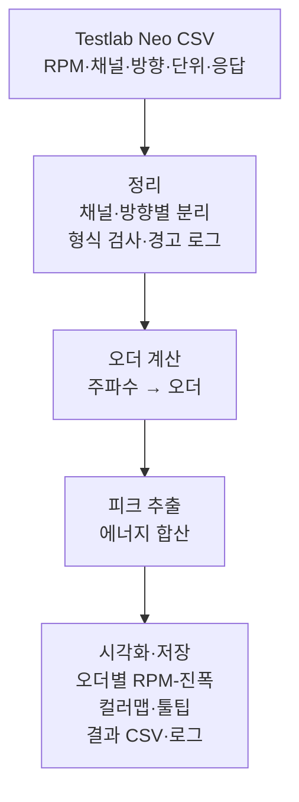

# 소음진동 오더 분석 도구 — 프로젝트 기획서

| 항목 | 내용 |
|---|---|
| 리포 | data09-06 |
| 제출자 | 조윤제 |
| 직무·소속 | 제출 자료에 명시되지 않음 (진동·소음(NVH) 시험·분석 업무 담당으로 보임 — (가정)) |
| 과정 | 현장 데이터 디지털화 전문가과정 1차수 |
| 작성일 | 2026-09-28 (v0.5 갱신 2026-09-30) |
| 문서 상태 | 초안 v0.5 — 제출자 분석기 v40 을 기준으로 RPM 별 Overall·오더 기여도(그래프·표시 옵션·XLSX 시트)를 더함 |

이 문서는 제출자의 게시물 「소음진동 오더 분석 도구 개발」(2026-09-23)과 2026-09-28 댓글로 받은 **제출자 분석기 v34(HTML)와 Testlab Neo 실제 내보내기 CSV 2종**을 바탕으로 합니다. 주파수축 데이터마다 RPM 이 붙어 있어 별도의 RPM 추정 없이 오더 계산이 가능하며, 계산 기준은 v34 를 따릅니다.

## 1. 추진 배경과 현안

- 배경: 시험 스펙트럼 데이터를 신속하게 오더 성분으로 분석하고 시각화하려는 것입니다.
- 현안(가정): 현재는 Testlab Neo에서 내보낸 결과를 엑셀 등에서 따로 가공해 오더별 그래프를 그리고 있을 것으로 보입니다. 실제 현재 방식은 10절에서 확인합니다.

## 2. 목표

**최종 목표**
Testlab Neo에서 내보낸 진동·소음 시험 결과를 넣으면 오더 분석, 피크 추출, 에너지 합산, 시각화, 결과 저장까지 같은 기준으로 나오는 분석 도구를 만듭니다.

**1차 개발 목표**
- Testlab Neo export CSV(RPM, 채널, 방향, 단위, 진동소음 응답)를 브라우저에 올리면
- 오더 분석, 피크 추출, 진동소음 에너지 합산을 계산하고
- 오더별 RPM-진폭 그래프, 스펙트럼 컬러맵, 피크 정보 툴팁으로 보여 주며
- 결과 CSV와 오류·경고 로그를 저장합니다.
- 제출자 분석기 v34 의 계산(피크 검색 → 합산 RSS, 오더 RSS 합산, dB/dBA 표시)을 기준으로 삼아 기능을 정리·보강합니다.

## 3. 보유 데이터

| 데이터 | 형태 | 규모·주기 | 비고(민감도 등) |
|---|---|---|---|
| Testlab Neo export 주파수축 CSV — 예시 2종 `sim)130B-X 36,45order.csv`, `sim)30B-X 39order.csv` | CSV (UTF-8 BOM, 쉼표) | 시험 건별. 예시는 Curve 20개(진동 4위치 × 5 RPM) / 60개(진동 4 + 소음 2 × 10 RPM), 1000~2000 Hz · 1 Hz 간격, 436 KB · 773 KB | 2026-09-28 수령, `docs/source/` 보관 |
| 제출자 분석기 v34 | HTML 1개(약 160 KB) | — | 2026-09-28 수령. 계산 기준 |

**실제 내보내기 형식 (확인됨)**

- 1줄 `Curve 1` 제목 → `MS Logging` 등 → `Standard\All\…` 머리 정보 줄(0열 = 항목 이름, 1열부터 **Curve 하나당 한 열**) → 빈 줄 → 단위 줄(`Hz, g, …, Pa`) → 표시 척도 줄(`Linear, Log (RMS), …, dB`) → 데이터.
- 데이터: **0열 = 공통 주파수(Hz)**, 1열부터 Curve별 진폭. 작은 값은 `7.05E-05` 같은 지수 표기, 파일 끝에 값 없는 `,,,,` 줄이 붙기도 합니다.
- **RPM** = `Dataset name` 글자에서 읽음(`rpm  2000`, `…RPM2000_Report to Excel`). `Original run` 은 실측 RPM(`rpm  2002`)이지만 공칭값을 씁니다(v34 와 같음).
- **위치·방향** = `DOF id`(`LL:+X`), 소음 채널은 방향 없음(`out`, `Pump`). **단위** = `Y axis unit`(진동 g, 소음 Pa).
- **표시 척도** `Log (RMS)` 는 값이 선형이고, `dB` 인 열(소음)은 값이 이미 dB(기준 20 µPa)입니다 → 계산 전에 Pa 로 되돌립니다.
- AutoPower · RMS · Hanning(진폭 보정) · 평균 2~7회 조건으로 만든 스펙트럼입니다.
- 파일 이름의 `36,45order` · `39order` 가 관심 오더를 나타냅니다.

제품 사양이 드러나는 시험 결과이므로 외부 AI 서비스로 보내지 않는 구조를 전제로 합니다.

## 4. 해결 방안 개요

- 계산은 제출자 분석기 v34 와 같습니다.
  - 이론 주파수 = 오더 × RPM ÷ 60 (회전비 설정 가능, 기본 1)
  - 이론 주파수 ± 피크 검색 범위(기본 ±1 Hz)에서 가장 큰 칸 = 검출 피크 (범위 0 이면 가장 가까운 칸)
  - 오더 진폭 = 검출 피크 ± 합산 범위(기본 ±1 Hz) 칸들의 제곱합의 제곱근(RSS)
  - 오더 2개 이상이면 같은 RPM 의 오더 진폭 RSS 합산
  - 표시: 소음·진동 따로 Amplitude / dB(기준 소음 2e-5 Pa, 진동 1.0197e-7 g) / dBA(검출 피크 주파수에서 A-가중)
  - 판정: 이론 주파수가 측정 주파수 범위 안이면 「일치」

## 5. 주요 기능

| 기능 | 설명 | 우선순위 |
|---|---|---|
| CSV 불러오기·형식 검사 | Testlab Neo export CSV 업로드, RPM·채널·방향·단위·응답 컬럼 인식, 빈 값·형식 오류를 경고 로그로 기록 | MVP |
| 채널·방향 선택 | 채널·방향별로 결과를 나누어 보기 | MVP |
| 오더 변환 | 주파수축을 RPM별 오더축으로 변환 | MVP |
| 오더 추적 | 지정한 오더의 RPM별 진폭(피크 검색 → 합산 RSS, v34 방식) → 오더별 RPM-진폭 그래프, 채널 겹쳐 보기 | MVP |
| 오더 RSS 합산 | 여러 오더 진폭을 같은 RPM 에서 RSS 로 합산 (v34) | MVP |
| 피크 추출 | RPM별·오더별 최대 피크(주파수, 오더, 진폭) 목록 | MVP |
| 에너지 합산 | 오더 RSS 합산(v34) + 지정 대역(Hz 또는 오더)의 RSS (이 도구가 더함) | MVP |
| 스펙트럼 컬러맵 | RPM × 주파수(또는 오더) 컬러맵 | MVP |
| 피크 정보 툴팁 | 그래프 위에 마우스를 올리면 RPM·주파수·오더·진폭 표시 | MVP |
| 결과 CSV 저장 | 오더별 결과·피크 목록·에너지 합산 CSV | MVP |
| 오류·경고 로그 저장 | 처리 중 발생한 경고를 텍스트/CSV로 저장 | MVP |
| 단위 변환·dB 표시 | 소음·진동 따로 Amplitude / dB / dBA, 원본 dB 입력 변환 (실제 파일에 dB 원본이 있어 1단계로 당김) | MVP |
| XLSX 저장 | v34 와 같은 시트·열(Settings·Order Analysis·Order RSS Sum) + 이 도구의 표 시트(오더별 최대·피크 목록·에너지 합산·경고 로그). 수강생이 v34 에서 이미 쓰고 있어 3차(2026-09-29)에 넣음 | MVP |
| 화면 편의 | 그래프·컬러맵 축 범위 입력(자동 되돌리기), 그래프 높이 끌어서 조절(기억), 끌어 놓기 업로드(여러 파일), 설정 바꾸면 즉시 다시 계산(큰 파일은 끔) — v34 에 있어 3차에 넣음 | MVP |
| Overall · 오더 기여도 | RPM 별 Overall(범위 칸 RSS)을 그래프에 선으로, 오더별 기여도(오더 에너지 ÷ Overall 에너지 %)를 누적 막대·표로. 그래프 표시 옵션(오더 RSS 합산·Overall·기여도 분석) 체크로 켜고 끔. XLSX 「기여도 분석」 시트. 제출자 요청으로 2026-09-30 에 넣음 | MVP |
| v40 화면 기능 | CSV 인식 신호등(초록·노랑·빨강), 컬러맵 보이는 범위 최대값 표시(MAX), 오더 축 정수 눈금·추적 오더 강조, Settings 시트의 Spectrum Map 가로축 기준·RSS 그래프 표시 — v40 에서 새로 생긴 것을 2026-09-30 에 옮김 | MVP |
| 다크 모드 | v34 에 있음 — 계산과 무관한 화면 테마 | 확장 |
| 여러 시험 비교 | 두 개 이상의 CSV를 겹쳐 비교 | 확장 |

## 6. 기대 산출물

- 브라우저 오더 분석 도구(정적 웹 — 제출자 분석기 v34 와 같은 계산, 테스트로 결과 대조)
- 결과 XLSX(v34·v40 과 같은 시트 + 기여도 분석 + 이 도구의 표) · 결과 CSV(오더 추적·오더 RSS 합산·오더별 최대·피크 목록·에너지 합산), 오류·경고 로그
- 오더별 RPM-진폭 그래프, 스펙트럼 컬러맵 화면
- 사용 안내문, 계산식 설명서(오더 정의·에너지 합산 방식)

## 7. 기술 구성

| 과정 도구 | 이 과제에서의 쓰임 |
|---|---|
| 코랩(Python) | numpy·scipy로 오더 계산·피크·에너지 합산 결과 검증 (DAY2) |
| 바이브코딩 | 제출자가 분석기 v34 를 만든 방식 — 이를 이어서 개선 |
| 생성형 AI | 이 과제의 핵심 경로에는 필요하지 않음 |
| Dify / Make | 이 과제의 핵심 경로에는 필요하지 않음 |

**개발 빌드**
- 설치가 필요 없는 브라우저 정적 웹 도구. CSV 파싱·계산·그래프(외부 라이브러리 없이 SVG·canvas, v34 도 canvas 직접 그림)를 모두 브라우저 안에서 처리해 시험 데이터가 밖으로 나가지 않게 합니다.
- XLSX 쓰기만 SheetJS 를 리포 안(`vendor/xlsx.full.min.js`)에 두고 XLSX 를 처음 저장할 때 불러옵니다 — 인터넷이 없어도, 파일로 열어도(file://) 동작합니다.

## 8. 개발 단계

**1단계 — MVP (완료, 2026-09-28 2차에서 v34 기준으로 맞춤)**
- Testlab Neo 내보내기 자동 인식·형식 검사·경고 로그
- v34 방식 오더 추적·오더 RSS 합산·판정, 소음/진동 dB·dBA 표시와 원본 dB 변환
- 오더별 RPM-진폭 그래프(채널 겹쳐 보기), 스펙트럼 컬러맵(범위·오더 선), 툴팁
- RPM 별 피크 목록, 대역 에너지 합산, 결과 CSV·경고 로그 저장
- 실제 파일 2종과 v34 계산 함수를 맞댄 자동 테스트

**1단계 보강 — v34 화면 기능 (3차, 2026-09-29)**
- XLSX 저장(v34 시트·열 그대로 + 이 도구의 표 시트)
- 그래프·컬러맵 축 범위 입력과 자동 되돌리기, 그래프 높이 끌어서 조절(브라우저에 기억)
- 끌어 놓기 업로드(여러 파일 → 「불러온 파일」 목록에서 바꿔 보기)
- 설정을 바꾸면 0.3초 뒤 즉시 다시 계산(끌 수 있음, 큰 파일은 저절로 꺼짐)

**1단계 보강 — v40 · Overall · 오더 기여도 (4차, 2026-09-30)**
- 제출자 분석기 v40 수령: 계산 함수는 v34 와 글자까지 같음(테스트로 확인). 새로 생긴 화면 기능(CSV 인식 신호등, 컬러맵 MAX, 오더 축 정수 눈금, Settings 항목)을 옮김
- RPM 별 Overall 선과 오더 기여도 누적 막대·표, 그래프 표시 옵션 체크 3개(오더 RSS 합산·Overall·기여도 분석, 브라우저에 기억)
- Overall 범위 설정(빈칸 = 측정 범위 전체), XLSX 「기여도 분석」 시트, 「기여도 분석 CSV」

**2단계 — 확장**
- 다크 모드(v34 에 있음)
- 여러 시험 비교(두 개 이상의 CSV를 한 그래프에 겹쳐 비교 — 지금은 여러 파일을 불러 하나씩 바꿔 봄)

## 9. 기대 효과

- 오더 분석·시각화를 파일 하나 올리는 것으로 끝내 시험 결과 검토가 빨라집니다.

(원문에 수치 목표가 없어 정량 효과는 적지 않았습니다.)

## 10. 확인 필요 사항

**답을 받은 것 (2026-09-28 v34·실제 파일)**

1. 초안 HTML·예시 Input CSV (답함) → 분석기 v34 와 실제 CSV 2종 수령, 1단계를 맞춤.
2. CSV 배치 (답함) → 머리 정보 블록 + 0열 공통 주파수 + Curve(위치·방향·RPM 조합)별 진폭 열. 채널·방향·RPM 은 머리 정보에 함께 들어 있음(3절).
3. 응답 단위와 dB 기준 (답함) → 진동 g(선형), 소음 Pa(원본 dB, 기준 20 µPa). 진동 dB 기준 1.0197e-7 g(1 µm/s²) — v34 기본값.
4. 에너지 합산 방식 (답함) → v34: 검출 피크 ± 합산 범위의 RSS, 여러 오더는 RSS 합산. 창 함수 보정은 Testlab 이 이미 적용(Hanning, 진폭 보정)한 값을 그대로 씀.
5. 피크 추출 기준 (답함) → v34: 오더마다 이론 주파수 ± 검색 범위(기본 ±1 Hz) 안 최대 칸 하나.

**2026-09-30 반영 — v40 기반 기능 추가 요청**

원문(2026-09-30 게시물, 2026-09-29 댓글 같은 내용):

> 링크의 v40 분석기를 기반으로 아래 기능 추가.
> (order analysis) RPM 별 overall, 기여도 분석할 수 있도록 그래프에 추가.
> 그래프 표시 옵션에 Overall, 기여도 분석 on/off 가능한 체크박스 추가.
> 엑셀 추출시 새 시트를 만들어서 기여도 분석 내용 삽입.

반영 방식:
- **v40 과 v34 를 먼저 비교했습니다.** 계산 함수(구조 읽기·오더 추적·RSS 합산·단위 변환 29개)는 v34 와 글자까지 같고, 바뀐 것은 화면입니다 — CSV 인식 확인 카드와 신호등, Spectrum Map 의 Frequency/Order 가로축 전환·정수 오더 눈금·최대값(MAX) 표시, 그래프 높이만 끌어 조절, 툴팁 숫자 4자리, Settings 시트의 「Spectrum Map 가로축 기준」. 이 도구에 없던 신호등·MAX·정수 눈금·Settings 항목을 옮겼습니다(가로축 전환·축 범위·높이 조절·확인 후 분석은 이미 있음).
- **v40 에 Overall·기여도 계산이 없어** 표준 정의를 썼습니다.
  - Overall = RPM 마다 Overall 범위(기본: 측정 범위 전체, 실제 파일은 1000~2000 Hz) 칸들의 제곱합의 제곱근(RSS). Testlab 칸 값이 RMS 이므로 그 범위의 전체 RMS 레벨입니다.
  - 오더 기여도(%) = 오더 에너지 ÷ Overall 에너지 × 100. 에너지 = 진폭² 이고, 오더 에너지는 v34 오더 진폭(검출 피크 ± 합산 범위 RSS)의 제곱 = 그 칸들의 제곱합입니다. 기타(오더 외) = 100 − 오더 기여도 합.
  - dB 로 봐도 기여도는 같은 에너지 비율입니다(Overall 만 dB 로 표시). dBA 로 볼 때는 칸마다 A-가중한 에너지로 나눕니다(오더는 검출 피크 주파수 가중 — v34 의 오더 RSS 합산 dBA 와 같은 규칙).
  - 창 함수 보정은 분자·분모에 같이 붙어 기여도 비율에는 영향이 없습니다.
  - 오더끼리 합산 창이 겹치거나 오더 창이 Overall 범위 밖으로 나가면 합이 실제보다 커지므로 경고 로그와 막대의 빨간 「!」 로 알립니다. 실제 파일 2종(36·45차, 39차, 합산 ±1 Hz)에서는 해당 없음.
- **그래프**: 오더별 RPM-진폭 그래프에 Overall 을 굵은 회색 선으로 더하고(툴팁에 오더별 기여도), 아래에 RPM 별 오더 기여도 누적 막대(오더 색 = 선 그래프 색, 기타 = 회색)와 표를 둡니다. 「그래프 표시 옵션」 체크 세 개 — 오더 RSS 합산(v34·v40 에 있던 것) · Overall · 기여도 분석 — 로 켜고 끄며 브라우저에 기억합니다. 끄면 그래프에서만 숨기고 XLSX·CSV 에는 그대로 담습니다(v40 RSS 체크와 같은 규칙).
- **엑셀**: XLSX 에 「기여도 분석」 시트를 새로 만듭니다 — 한 행 = 채널 × RPM, 열 = 채널·위치·방향·종류·RPM·Overall 범위·칸 수·Overall 내부값(선형 RSS)·Overall 표시값·표시단위, 오더마다 「표시진폭 · 기여도_%」, 오더 합 기여도_%, 기타(오더 외)_%, 기여도 기준, 확인. 같은 표를 「기여도 분석 CSV」 로도 저장합니다. Settings 시트에 Overall 범위·기여도 기준·그래프 표시 여부를 적습니다.

확인 부탁(제출자):
- 기여도를 **에너지(진폭²) 비율 %** 로 정했습니다. 진폭 비율(오더 진폭 ÷ Overall 진폭)이나 dB 차(Overall dB − 오더 dB)로 보시는 것이 현장 기준이면 알려 주세요 — 그 방식으로 바꾸겠습니다.
- Overall 범위를 측정 범위 전체(파일의 1000~2000 Hz)로 두었습니다. 다른 범위(예: 오더 주변 대역)를 쓰시면 값을 알려 주세요(설정 칸에 바로 넣을 수 있습니다).
- 기여도 막대에 여러 채널을 한 번에 그릴지(지금은 고른 채널 하나, 표·XLSX 는 모든 채널).

**아직 확인할 것**

1. 직무·소속, 시험 대상 기종·부위(파일로 보아 130B-X·30B-X 유압 펌프 마운트 — (가정))
2. 오더 기준 회전축과 기어비 — 파일 이름의 36·45·39 차가 어느 축 기준인지 (지금은 회전비 1 = v34 와 같음)
3. 이 도구가 더한 RPM 별 피크 목록·대역 에너지 합산을 계속 쓸지
4. 현재 분석 1건당 소요시간(효과 측정용)

## 부록. 제출 원문 요약

- 게시물 (2026-09-23) 「소음진동 오더 분석 도구 개발」: Input(Testlab Neo export 주파수축 CSV), Output 1~3(오더 분석·피크·에너지 합산 / 시각화 / CSV·로그 저장), 초안 HTML·예시 CSV는 메일 전달로 기재
- 첨부 파일: 게시물에는 첨부 없음. 2026-09-28 댓글 「분석기 기능 최신화하여 업로드 하였습니다. Input 예제 파일도 업로드했습니다.」 의 드라이브 폴더에서 분석기 v34 HTML 과 예시 CSV 2종을 받아 `docs/source/` 에 보관. 2026-09-30 게시물의 드라이브 링크에서 분석기 v40 HTML(`docs/source/order_analysis_v40.html`)을 받음
- 제외 자료: 2026-09-09 게시물 「진동·소음 시계열 데이터 자동 분석」은 제출자가 2026-09-28에 직접 삭제해 이 문서에서 제외했습니다.
- 문서 이력: v0.1(게시물 2건 기반) → v0.2(수강생 요청으로 과제 1건으로 정리) → v0.3(수강생 분석기 v34·실제 입력 파일 반영) → v0.4(v34 의 XLSX·축 범위·높이 조절·끌어 놓기·즉시 다시 계산을 1단계에 넣음, 2026-09-29) → v0.5(분석기 v40 기준 Overall·오더 기여도·그래프 표시 옵션·기여도 XLSX 시트, 2026-09-30)
